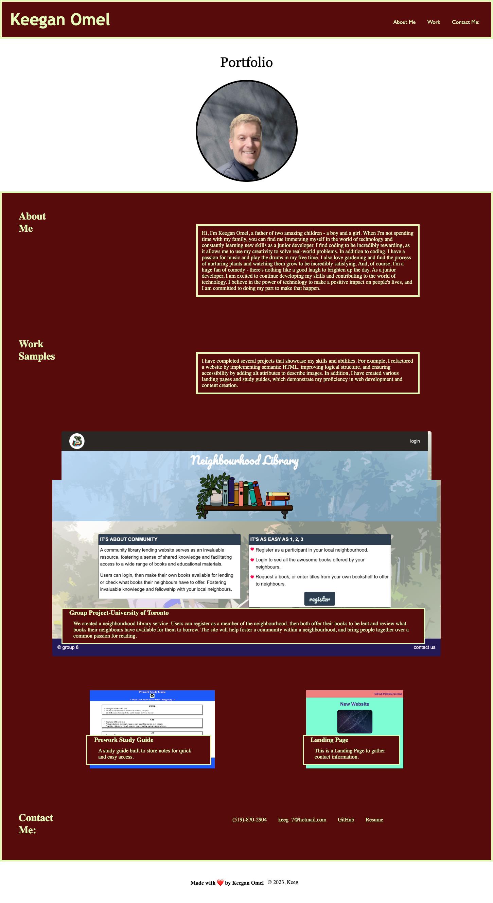

# Career Porfolio

## Description 
The following project is a Career Portfolio written using semantic HTML, with logical structure and alt attributes meeting accessibility standards. I have a Portfolio picture edited over a looping video for effect. The website demonstrates the use of a navigation bar that scrolls to each relative section on the page. The webpage consist of an About me section, a Work samples section with functioning links to the live deployed websites. At the bottom there is a Contact me section with functioning links to my email, phone number, github portfolio, and resume.

## Author
Keegan Omel

## Contributors
Bruno Rosarini,
Austin Grech,

## Live Link

https://keegan-omel.github.io/Career-Porfolio-Module02-Project/

## GitHub Link

https://github.com/Keegan-Omel
